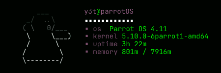

# GhostlyFetch 👻

GlostlyFetch it's a UNIX shell tool for fetching system info like kernel version, memory stats and uptime  

Don't get scared by Bob [^1], he is the ghost that fetches the informations for you! He's harmless and cute.  

 

**Try using the *-spooky* option 👻** 

## Installing

To install GhostlyFetch you'll need the [rust compiler](https://www.rust-lang.org/tools/install) in your system
and run the following commands:

 - `git clone https://github.com/LucasVChaves/ghostlyfetch`  
 - `cd ghostlyfetch`  
 - `cargo install --path .`

## License

This program is licensed under the MIT license

[^1]: The formatting is a bit funky right now, but i'm working on it. 

👻*boo*  